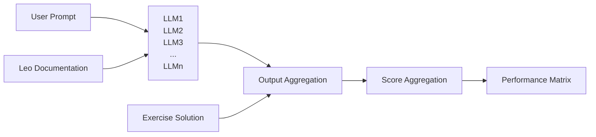
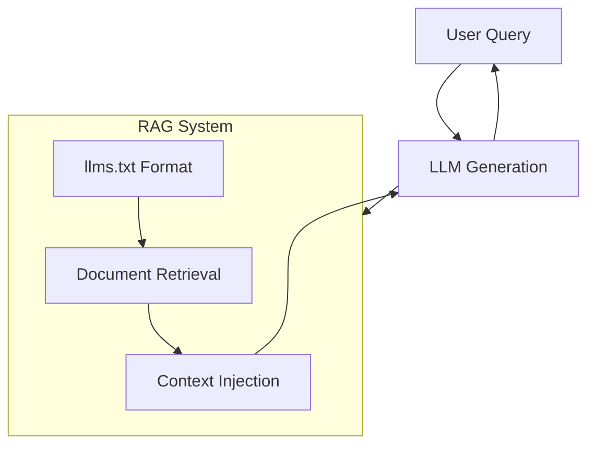
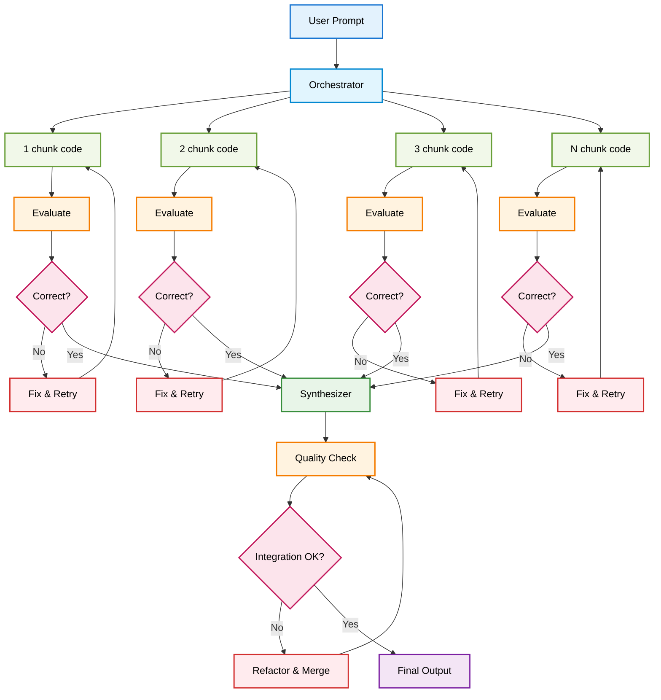
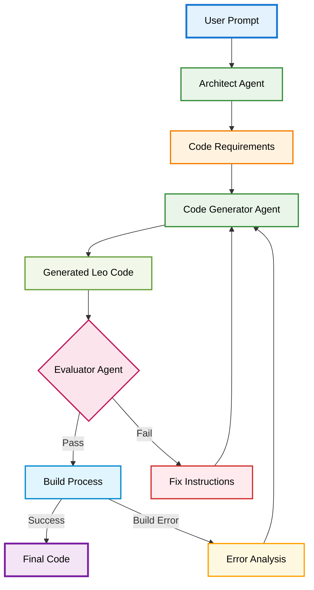

# ZeroToLeo

## Abstract

This research presents the development of an AI assistant specialized in generating functional Leo code for smart contract development on the Aleo blockchain. The primary challenge addressed is the limited availability of Leo language datasets, which leads to significant hallucination rates in Large Language Models (LLMs). Through systematic testing of multiple LLMs and exploration of various approaches including fine-tuning, Retrieval-Augmented Generation (RAG), and agentic workflows, we developed a deterministic multi-agent architecture that successfully generates compilable Leo code. Our solution employs a prompt chaining strategy with an evaluator gate, combined with iteratively refined golden rules extracted from error logs, achieving a significant reduction in code generation errors.

## 1. Introduction

The emergence of privacy-focused blockchain platforms like Aleo has introduced new programming paradigms, with Leo serving as the primary language for developing zero-knowledge smart contracts. However, the adoption of Leo faces a critical challenge: the severe limitation of available training data for Large Language Models (LLMs), combined with lacks of edge cases and practical implementation patterns.

This research addresses the fundamental question: **Is it truly possible to generate functional, compilable Leo code using AI assistants given these constraints?**

Initial tests revealed concerning levels of hallucinations, with models frequently generating code in Solidity or Rust instead of Leo, incorporating non-existent paradigms, and producing non-compilable outputs. 

🔴 **We find ourselves in the worst-case scenario for LLM application: a domain with minimal training data, evolving syntax, and limited community resources.**

## 2. Methodology

### 2.1 Initial Model Assessment

Our first objective was to identify which LLM performs best when generating Leo code. We constructed a comprehensive test suite comprising simple, medium, and complex exercises.

**Exercise Categories:**
- **Simple**: Basic token implementation
- **Medium**: Voting systems, basic DeFi protocols
- **Complex**: Burrow protocols

Each exercise followed a standardized structure:

**Testing Protocol:**
1. Prompt: "Build: [specific Leo project description]"
2. Automated script execution across multiple LLMs using Openrouter Api
3. Self-evaluation by each LLM using:
   - Official Leo documentation (restructured)
   - Correct exercise solutions
   - Standardized evaluation rubric
4. Result aggregation and performance matrix generation

### 2.3 Test Results and Model Performance

Performance Ranking:

    1. Claude models ( claude-opus-4-20250514, claude-sonnet-4-20250514, claude-3-7-sonnet-20240620 ) 
    2. GPT models ( gpt-4.1-2025-04-14 , o3-2025-04-16 ) 
    3. Deepseek-reasone
    4. Claude-3-5-sonnet-20240620 
    5. Gemini 2.5 Pro 
    
**Key Findings:**

- Chain-of-thought models significantly outperformed non-reasoning models
- Hallucination rates exceeded **60%** across all models initially
- Common failure patterns included:
  1. Code generation in Solidity despite explicit instructions
  2. Rust syntax infiltration
  3. Non-existent Leo paradigm usage (e.g., incorrect mapping syntax, async/sync patterns)
  4. Fundamental misunderstanding of Leo's computational model

### 2.4 Initial Conclusions

1. **Mandatory requirement**: Chain-of-thought reasoning capability
2. **Need for novel approach**: Traditional LLM usage insufficient
3. **Model selection**: Based on functional requirements, we selected three models for further testing

## 3. Explored Approaches

### 3.1 Fine-tuning Investigation

**Research Question**: Can we fine-tune a model effectively with available Leo documentation and code?

**Methodology**:
- Catalogued all public Leo repositories in a comprehensive Excel database
- Attempted to construct JSON training datasets for model fine-tuning
- Analyzed data volume requirements for effective fine-tuning

**Results**: 
- Total available training examples: < 1,000 quality samples
- Minimum required for effective fine-tuning: ~10,000-50,000 samples
- **Conclusion**: Insufficient data for viable fine-tuning approach

### 3.2 Retrieval-Augmented Generation (RAG)

**Research Question**: Can dynamic documentation loading improve Leo code generation accuracy?

**Implementation**:
- Created GitHub repository with forked Aleo documentation
- Reorganized documentation following `llms.txt` methodology
- Deployed Model Context Protocol (MCP) server for testing

**Results**:
- Added latency overhead: RAG introduces an additional retrieval step that slows down code generation without proportional benefits for simple syntax tasks
- Inconsistent retrieval quality: Vector search may return obsolete, irrelevant, or poorly segmented documentation chunks that don't match query intent
- Architectural complexity: Requires maintaining additional infrastructure (MCP servers, vector databases, embedding models) with multiple potential failure points
- Poor pattern recognition: Leo code requires understanding of language-specific idioms and best practices that work better as integrated knowledge rather than retrieved snippets
  
### 3.3 Agentic Workflow Architecture

After exhausting traditional approaches, we pivoted to building an agentic workflow system.

**Key Distinction**: True agentic systems vs. simple ChatGPT wrappers
- Autonomous decision-making capabilities
- Inter-agent communication protocols
- Iterative improvement mechanisms

## 4. System Architecture Design

### 4.1 Architectural Decisions

We evaluated two primary workflow designs:

1. **Orchestrator + Prompt Chaining**

2. **Evaluator + Prompt Chaining** ✓ (Selected)

The evaluator-based design was chosen due to time constraints and its natural fit as a quality gate mechanism.

### 4.2 Agent Specifications

**1. Architect Agent**
- Transforms user prompts into structured code requirements
- Defines feature specifications and constraints
- Outputs detailed design documents

**2. Code Generator Agent**
- Receives structured requirements
- Generates Leo code based on enhanced documentation
- Implements fixes based on feedback loops

**3. Evaluator Agent**
- Acts as quality gate
- Evaluates code against:
  - Design specifications
  - Leo syntax rules
  - Compilation requirements
- Provides detailed feedback for improvements

### 4.3 System Prompt Engineering

Our iterative approach to system prompt development:

1. **Baseline Prompts**: Adapted from existing AI coding assistants (Lovable, Cursor)
2. **Leo-Specific Rules**: Incorporated language-specific constraints
3. **Golden Rules Integration**: Added patterns discovered through error analysis
4. **Continuous Refinement**: Updated based on execution logs

**Results**: 20% reduction in hallucinations through optimized system prompts alone

## 5. Testing and Results

### 5.1 Model Performance Evaluation

**Key Observations**:
- **Claude Opus**: Paradoxically underperformed due to over-complexity
- **Claude 3.5**: Tendency to "cheat" - mismatched requirements with shortcuts
- **Claude 3.7 **: Underperforms Claude 4 
- **Final Selection**: Claude 4 (latest capabilities)
  

### 5.2 Workflow Execution Process

The deterministic workflow operates as follows:

1. **Requirement Analysis**
   - Architect Agent develops comprehensive code requirements
   - Structured specification document generated

2. **Code Generation Loop**
   - Code Generator Agent produces initial Leo implementation
   - Evaluator Agent assesses against criteria
   - Iterative refinement through Agent-to-Agent (A2A) communication

3. **Build Validation**
   - Successful compilation → Process complete
   - Build errors → Error analysis and targeted fixes

### 5.3 Golden Rules System

Through systematic error log analysis, we developed an adaptive learning mechanism:

**Example Golden Rules**:
    NAMING BEST PRACTICES (≤31 bytes): ( the model is own Rules without human intervation ) 
    • finalize_mint ✓ (13 bytes)
    • finalize_burn ✓ (13 bytes)  
    • finalize_transfer_pub ✓ (19 bytes)
    • finalize_priv_to_pub ✓ (18 bytes)
    • AVOID: finalize_transfer_private_to_public ✗ (35 bytes)

## 6. Results and Performance Metrics

The system demonstrates strong compilation success rates that correlate inversely with project complexity:

Simple projects: Achieve near-universal first-attempt compilation success, reflecting the system's reliability for straightforward development tasks
Medium complexity projects: Show high success rates with minimal iteration requirements, typically requiring only minor adjustments
Complex projects: Maintain good success rates despite increased complexity, though may require several refinement iterations to achieve full compilation

The progressive decrease in first-attempt success rates across complexity levels is expected and demonstrates the system's ability to handle increasingly sophisticated development challenges while maintaining practical utility across all project types.

## 7. Discussion

### 7.1 Critical Success Factors

1. **Documentation Restructuring**: The `llms.txt` approach proved crucial for consistent context delivery
2. **Deterministic Workflows**: Provided predictable, cost-effective execution paths
3. **Iterative Learning**: Golden rules system enabled continuous improvement
4. **Agent Specialization**: Separation of concerns improved overall quality

### 7.2 Limitations and Challenges

- **Data Scarcity**: Remains the fundamental constraint
- **Language Evolution**: Leo syntax updates require constant maintenance
- **Complex Project Limitations**: Multi-contract systems remain challenging, though this is achievable by creating a fragmented design with an enrichment step, or by developing an agent that handles inter-smart contract linking through specialized search capabilities
- **Cost Considerations**: Multiple agent calls increase API costs. We need to build our agent framework while reducing functional costs by removing a framework layer and implementing better cost optimization strategies.

## 8. Conclusion

This research demonstrates that generating functional Leo code through AI assistance is indeed possible, despite operating in worst-case conditions of limited training data and incomplete documentation. The key breakthrough came from abandoning traditional LLM approaches in favor of a specialized agentic workflow with continuous learning capabilities.

Our system achieves:
- High compilation success rate for simple to medium complexity projects
- Dramatic reduction in language confusion (Solidity/Rust hallucinations)
- Practical usability for real-world Leo development

The combination of structured documentation, deterministic agent workflows, and adaptive golden rules provides a viable path forward for AI-assisted development in emerging programming languages with limited ecosystem support.

## References

1. Anthropic. (2024). "Building Effective Agents." Retrieved from https://www.anthropic.com/engineering/building-effective-agents
2. AnswerDotAI. (2024). "LLMs.txt Specification." Retrieved from https://github.com/AnswerDotAI/llms-txt
3. Model Context Protocol. (2024). "Introduction to MCP." Retrieved from https://modelcontextprotocol.io/introduction
4. Aleo. (2024). "Official Leo Documentation." Retrieved from https://developer.aleo.org/leo/

## Appendices

### Appendix A: LLMs.txt Methodology

The `llms.txt` approach involves creating a structured, LLM-friendly version of documentation that:
- Eliminates ambiguity in syntax descriptions
- Provides clear examples for each concept
- Structures information hierarchically
- Removes redundant or conflicting information

### Appendix B: Model Context Protocol (MCP)

MCP enables dynamic context injection through:
- Server-based documentation hosting
- Real-time context updates
- Structured query interfaces
- Version control for documentation changes

### Appendix C: Agentic Workflows

True agentic systems differ from simple wrappers by implementing:
- Autonomous decision-making based on evaluation criteria
- Inter-agent communication protocols
- State management across conversation turns
- Self-improvement mechanisms through feedback loops

